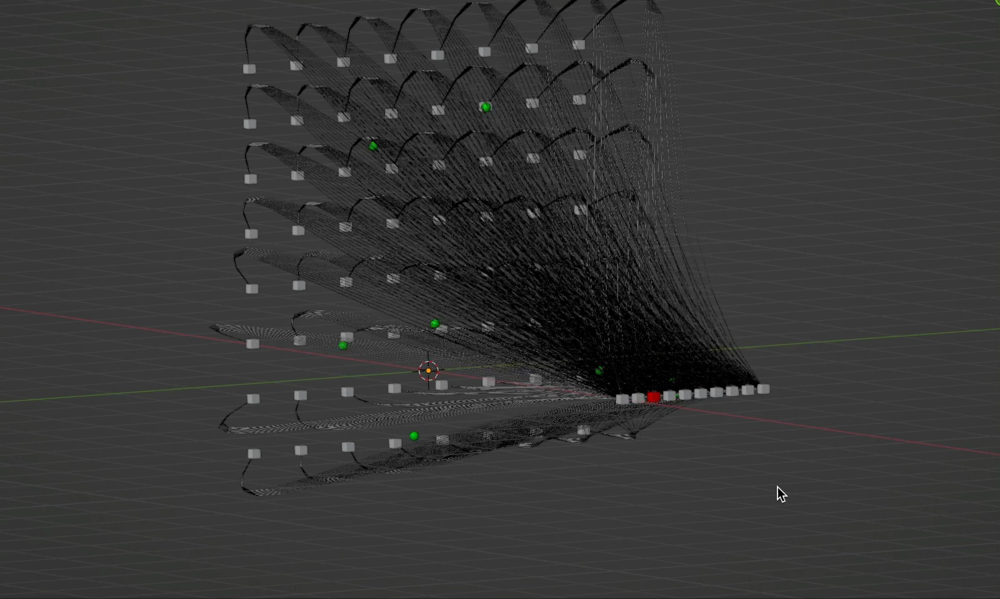

# 3DGPT
## 3D Graphics Programming Techniques

Use ChatGPT or any LLM to generate Blender script to create 3D scenes.
Use Blender from command line to generate the GLB file.
Use threejs to rendr the glb file in the browser.

The full article is available at [Prompt To Pixels- Analogarithm](https://analogarithm.com/from-prompt-to-pixels-creating-blender-animations-with-ai-in-minutes-5e262b17c799)

## The screenshot 


## Generate GLB file, from the shell
```bash
/Applications/Blender.app/Contents/MacOS/Blender -b -P script.py
```

## The Code to Generate GLB file
```python

# Set output path for the .glb file
output_path = "output_scene.glb"
bpy.ops.export_scene.gltf(filepath=output_path, export_format='GLB', export_animations=True)

```
## Run any web server to serve

```bash
 python3 -m http.server 9999
```